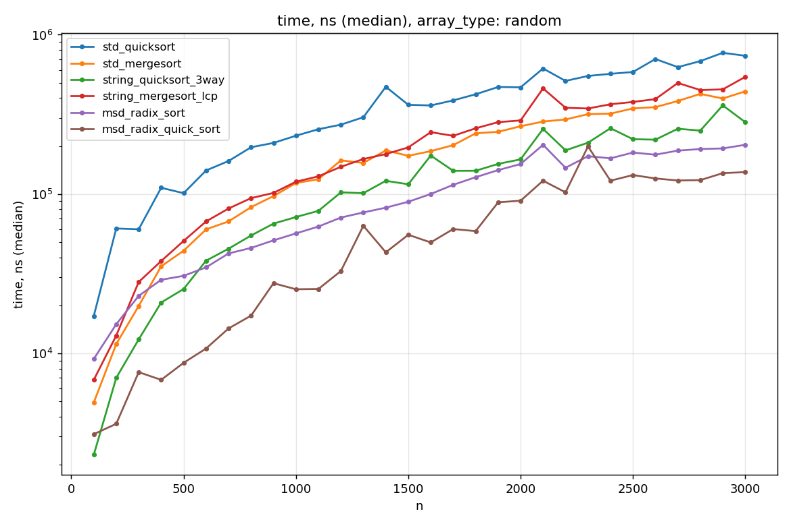
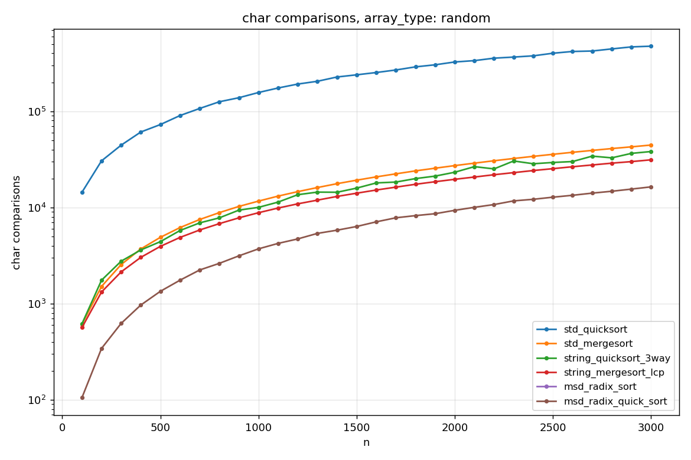
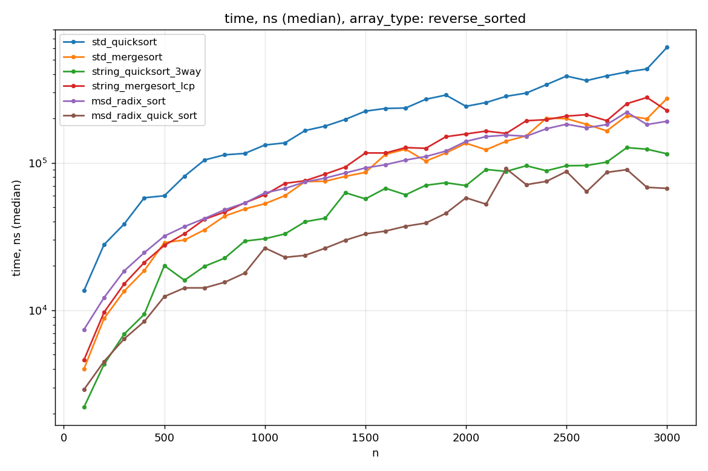
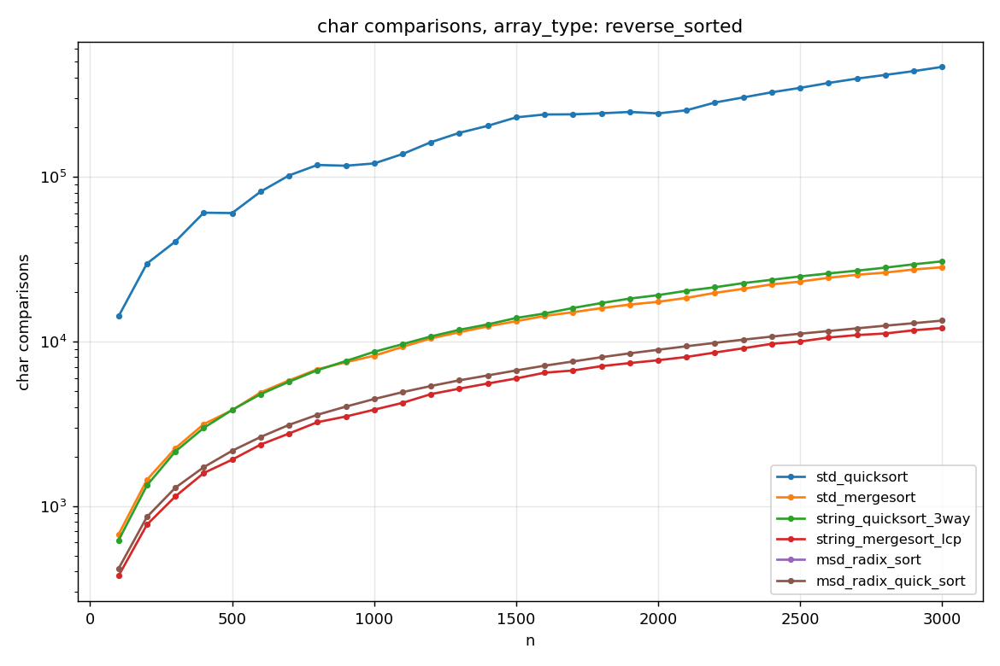
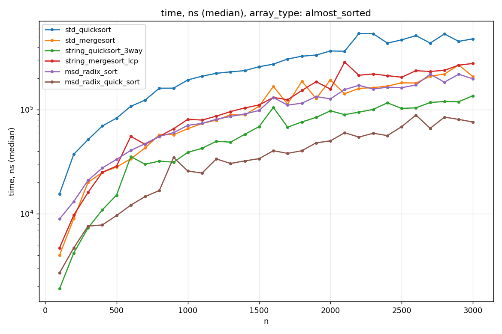
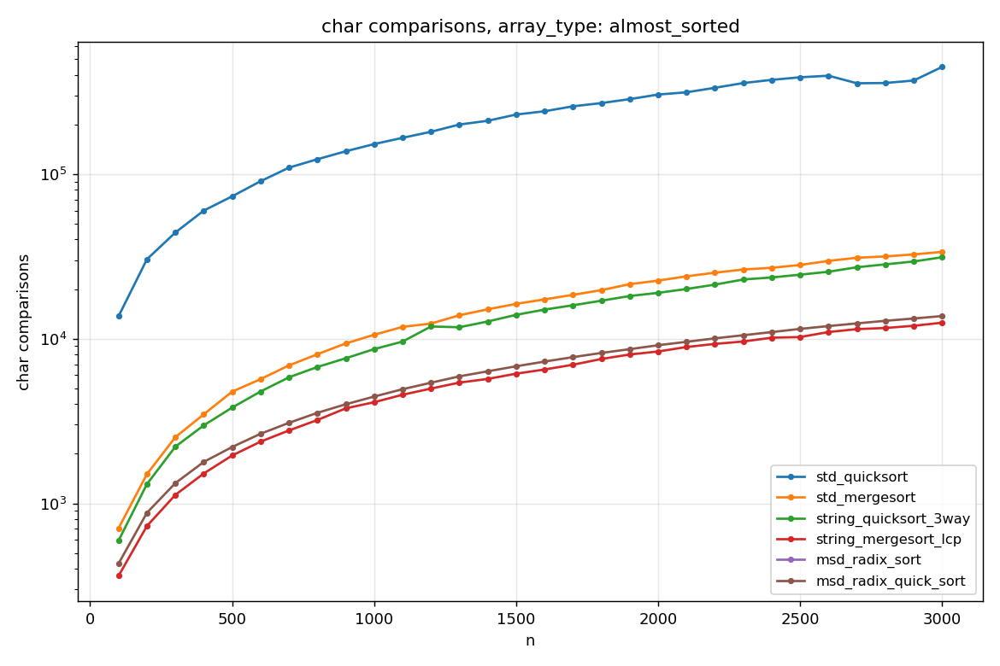
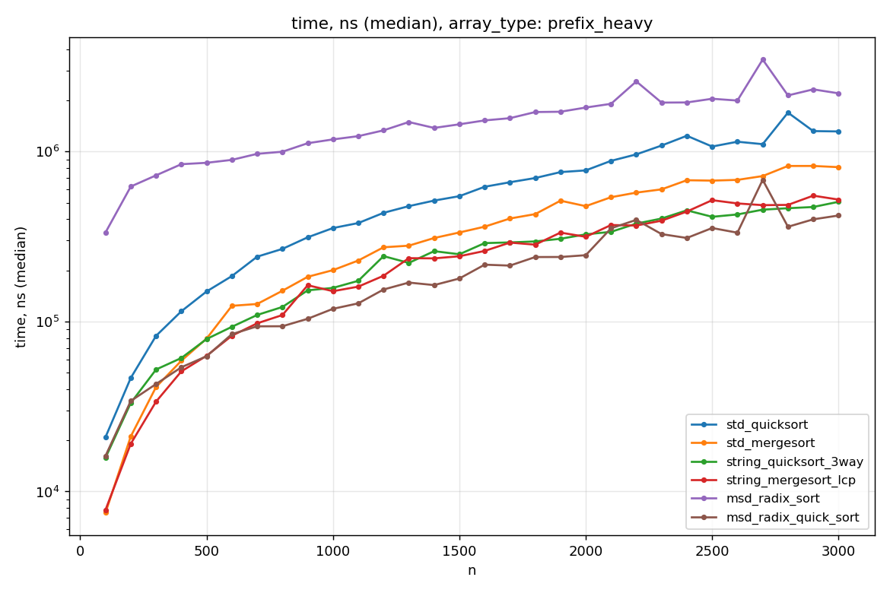
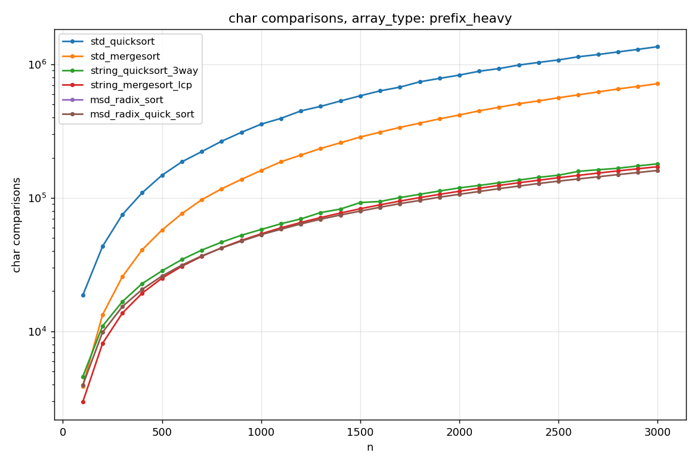

# SET 9, задача A1 — анализ строковых сортировок

**Выполнила:** Алибаева Алия Арслановна
**Репозиторий:** https://github.com/akrimest/Set9_A1

## Задача

Сравнить производительность стандартных алгоритмов сортировки (`std_quicksort`, `std_mergesort`) и адаптированных строковых (`string_quicksort_3way`, `string_mergesort_lcp`, `msd_radix_sort`, `msd_radix_quick_sort`) на массивах строк в прямом лексикографическом порядке. Алфавит — 74 символа (`A..Z`, `a..z`, `0..9`, `!@#%:;^&*()-.`), длины строк 10..200, размеры массивов 100..3000 с шагом 100, три типа массивов: случайные, обратно отсортированные, почти отсортированные (плюс бонусный с длинными общими префиксами).

## Инфраструктура

Реализована на C++, два ключевых класса:
- **`StringGenerator`** (`A/src/StringGenerator.{h,cpp}`) — один раз генерирует master-массив на 3000 строк для каждого типа, подмассивы нужного размера берутся срезом (как и просит задание). Seed фиксирован (`20260525`), результат полностью воспроизводим.
- **`StringSortTester`** (`A/src/StringSortTester.{h,cpp}`) — для каждой пары (тип массива, размер) запускает каждый из 6 алгоритмов на свежей копии, измеряет время `std::chrono::steady_clock` в наносекундах, считает посимвольные сравнения через единый глобальный счётчик в `common.h`. Каждый замер повторяется 5 раз, в CSV пишется медиана

Опорный элемент в обычной и в тернарной версиях quicksort выбирается одинаково — `a[(lo+hi)/2]` (требование задания). У всех алгоритмов одинаковый посимвольный компаратор (`lcpCompare` из `common.h`), поэтому количество сравнений напрямую сопоставимо.

Полный прогон занимает около минуты. Результаты — в `A/data/results.csv`.

## Алгоритмы и теоретические оценки

В работе сравниваются 6 алгоритмов (далее n — число строк, L — средняя длина, N — суммарная длина всех строк).

`std_quicksort` — классический quicksort с pivot = средний элемент, строки сравниваются посимвольно с начала. Теоретическая оценка O(n log n  * L) в среднем и O(n^2 * L) в худшем. `std_mergesort` — обычный top-down merge sort с тем же посимвольным сравнением, O(n log n * L).

`string_quicksort_3way` — тернарный 3-way по d-му символу, при равенстве углубляется по d+1, в среднем работает за O(N + n log n). `string_mergesort_lcp` — merge sort, в котором при слиянии используется `lcpCompare(a, b, k)`: общий префикс уже известен, новое сравнение начинается с k-й позиции, что даёт O(n log n + D), где D — суммарная длина различающих хвостов.

`msd_radix_sort` сортирует поразрядно со старшего символа, на каждом уровне распределяет строки по R+1 корзинам и рекурсивно сортирует непустые — теоретически O(N), но с большой константой из-за того, что обработка корзин происходит даже когда они пустые. `msd_radix_quick_sort` — тот же MSD radix, но при `|подмассив| < 74` переключается на тернарный string QS, что убирает накладные расходы на мелких хвостах.

## Замеры

Полные результаты в `A/data/results.csv`. Графики ниже строятся скриптом `A/scripts/plot.py`, по графику времени и числа сравнений на каждый тип массива.

## Анализ

### Случайные массивы

На случайных строках общие префиксы коротки, поэтому стандартное сравнение заканчивается на первом-втором символе и адаптированные алгоритмы выигрывают умеренно. По времени `std_quicksort` идёт верхней линией, `std_mergesort` и `string_mergesort_lcp` тянутся рядом, `string_quicksort_3way` ниже, и быстрее всех — `msd_radix_quick_sort` (примерно в 4–5 раз быстрее `std_quicksort` на n = 3000).

По числу сравнений картина куда жёстче: `std_quicksort` выдаёт ~5 * 10^5 сравнений при n = 3000, а `string_mergesort_lcp` — около 3 * 10^4, то есть экономия больше чем на порядок. `std_mergesort` и `string_quicksort_3way` идут средней группой (~4 * 10^4). `msd_radix_sort` показывает 0 сравнений (на логарифмической шкале просто не отображается) — это корректное поведение, radix формально посимвольных сравнений не делает.

### Обратно отсортированные

`std_quicksort` страдает заметнее всего — pivot из середины не катастрофичен (как был бы первый элемент), но всё равно деление получается несбалансированным. По времени он уходит в отрыв вверх, а `msd_radix_quick_sort` и `string_quicksort_3way` лежат в самом низу. `string_mergesort_lcp`, `std_mergesort` и `msd_radix_sort` идут плотной средней группой — mergesort'ам всё равно, какой порядок в исходных данных, а radix зависит только от структуры символов.

По сравнениям `string_mergesort_lcp` снова самый экономный среди comparison-based алгоритмов (~1 * 10^4 при n = 3000 против ~5 * 10^5 у `std_quicksort`). Тернарный QS и стандартный mergesort идут вместе.

### Почти отсортированные

Картина похожа на обратно отсортированный случай, но мягче — инверсий мало. `std_quicksort` по-прежнему верхняя линия (хотя разрыв меньше), `msd_radix_quick_sort` и `string_quicksort_3way` — самые быстрые, остальные посередине. По сравнениям `string_mergesort_lcp` снова лидирует.

### Массивы с длинными общими префиксами

Здесь интересный сюрприз: чистый `msd_radix_sort` оказывается самым медленным алгоритмом (фиолетовая верхняя линия) — на префиксах длиной около 50 символов он лезет на 50 уровней рекурсии, каждый уровень платит за обработку 256 корзин при том, что большинство пустые. `std_quicksort` идёт вторым с конца. А `msd_radix_quick_sort`, `string_mergesort_lcp` и `string_quicksort_3way` — все плотной нижней группой, в 3–5 раз быстрее `msd_radix_sort` и примерно в 3 раза быстрее `std_quicksort`. Это самое яркое подтверждение, зачем нужно переключение MSD radix на quicksort.

По сравнениям разрыв ожидаемо максимальный: `std_quicksort` даёт около 1,4 * 10^6 сравнений, `std_mergesort` — ~7 * 10^5, а адаптированные (`string_mergesort_lcp`, `string_quicksort_3way`, `msd_radix_quick_sort`) — порядка 1,6 * 10^5. Разница примерно в 9 раз между лучшим и худшим, и именно тут видно, ради чего LCP-merge sort и тернарный string QS затевались.

### Сопоставление с теоретическими оценками

Графики на лог-шкале согласуются с теорией: у обоих стандартных алгоритмов виден характерный профиль n log n с множителем L (особенно ярко на `prefix_heavy`, где L реально большое), у `string_quicksort_3way` и `string_mergesort_lcp` — близко к n log n с малой константой, у MSD radix — почти линейная зависимость, но именно линейная по N, а не по n, поэтому константа большая. Переключение `msd_radix → string_quicksort` при `n < 74` даёт стабильный выигрыш на всех типах массивов, особенно на `prefix_heavy`, где разница доходит до 5x.

### Стандартные vs адаптированные

`msd_radix_quick_sort` оказывается самым быстрым по времени на всех четырёх типах массивов: на `random` 137k нс против 737k у `std_quicksort`, на `reverse_sorted` 67k против 608k (~9x), на `almost_sorted` 76k против 479k, на `prefix_heavy` 420k против 1.3m. Тернарный `string_quicksort_3way` — стабильно второй или третий по скорости.

Однако безусловного выигрыша «всё адаптированное лучше всего стандартного» нет. На случайных строках `string_mergesort_lcp` (543k нс) даже немного медленнее обычного `std_mergesort` (440k нс) — короткие общие префиксы не окупают накладных расходов на LCP-учёт. И `msd_radix_sort` без переключения на `prefix_heavy` сильно проигрывает обоим стандартным алгоритмам (2.2M нс против 1.3M у `std_quicksort` и 809k у `std_mergesort`) — из-за 256 корзин на каждом из ~50 уровней рекурсии. Именно поэтому переключение в `msd_radix_quick_sort` так критично.

По числу посимвольных сравнений лидер зависит от типа массива. На `reverse_sorted` и `almost_sorted` самый экономный — `string_mergesort_lcp` (12058 и 12497 сравнений соответственно). На `random` (16356) и `prefix_heavy` (160560) меньше сравнений делает `msd_radix_quick_sort` — потому что radix-фаза снимает большую часть работы вообще без сравнений, и только короткие хвосты доходят до тернарного QS. `std_quicksort` стабильно худший по сравнениям на всех типах (от 446k на `almost_sorted` до 1.36M на `prefix_heavy`). `msd_radix_sort` показывает 0 — по условию задания засчитываются только посимвольные сравнения, а radix их в чистом виде не делает.

## ID посылок CodeForces

| Задача | Файл                    | ID посылки  |
|--------|-------------------------|-------------|
| A1m    | `A/codeforces/A1m.cpp`  | 375982208   |
| A1q    | `A/codeforces/A1q.cpp`  | 375982477   |
| A1r    | `A/codeforces/A1r.cpp`  | 375982621   |
| A1rq   | `A/codeforces/A1rq.cpp` | 375982848   |
